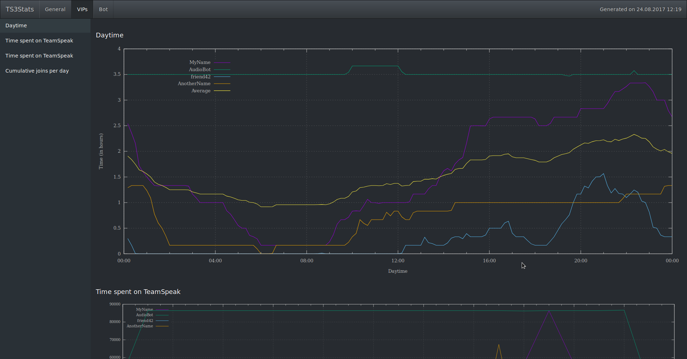

# TeamSpeak3 statistics
Create user statistics for a TeamSpeak3 server and (optionally) for the [TS3AudioBot](https://github.com/Splamy/TS3AudioBot).

## Usage
 1. Put all server log files into a folder `Logs`.
 1. (optional) Put all TS3AudioBot logs into a folder `BotLogs`
 1. Create your `Settings.py` and fill at least the `vips` list
 1. Run `./CreateTimeGraphs.py`
 1. Open `Result/index.html` in a browser and enjoy the statistics

## Configuration
All configuration can be put into a file called `Settings.py` and it will be picked up from there. The defaults for all options can be observed at the beginning of `CreateTimeGraphs.py`.

Some diagrams are only done for a couple of users. You can configure for which users by setting the `vips` list:  
`vips = ["MyName", "friend42"]`

To merge multiple identities into a single user, use the `merges` list:  
`merges = [["MyName", "MyNameLaptop"], ["friend42", "friend43"]]`

As diagrams can be quite crowded when a server runs for a while, you can configure, when people are shown in some diagrams.

 - `minTime = timedelta(hours = 10)` is the minimum connection time a user must have, before he is shown in the connection times
 - `minConnects = 8` is the minimum count a user must connect, before he is shown in the connections diagram

Enable statistics for the TS3AudioBot with `botStats = True`.

# Demo

An example of how the statistics look ([full site](https://flakebi.github.io/ts3stats/Result/)).

